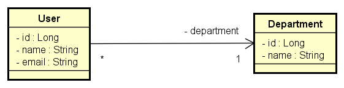
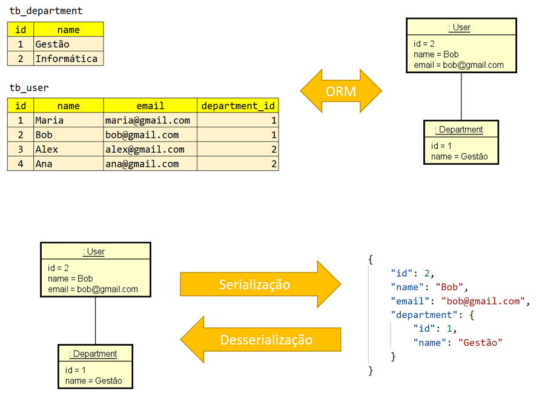

# Projeto para Estudos de API REST com SpringBoot

Este projeto foi desenvolvido para estudos de API REST utilizando SpringBoot, em parceria com [DevSuperior](https://github.com/devsuperior).

- **Link do repositório**: [https://github.com/devsuperior/java-web-spring-2022](https://github.com/devsuperior/java-web-spring-2022)

## Visão Geral do Sistema

O objetivo é construir uma pequena API REST de gerenciamento de usuários e departamentos, com os seguintes casos de uso:

- **Buscar todos os usuários**
- **Buscar um usuário pelo seu ID**
- **Inserir um novo usuário**



### Desenvolvimento Moderno: Relacional -> Objeto -> JSON



## Trechos de Código para Copiar

### Configuração do Maven Resources Plugin
```xml
<plugin>
	<groupId>org.apache.maven.plugins</groupId>
	<artifactId>maven-resources-plugin</artifactId>
	<version>3.1.0</version>
</plugin>
```

### Configurações do banco de dados
```xml
# Dados de conexão com o banco H2**
spring.datasource.url=jdbc:h2:mem:testdb
spring.datasource.username=sa
spring.datasource.password=

# Configuração do cliente web do banco H2**
spring.h2.console.enabled=true
spring.h2.console.path=/h2-console

# Configuração para mostrar o SQL no console**
spring.jpa.show-sql=true
spring.jpa.properties.hibernate.format_sql=true
```

## Script SQL
```xml
INSERT INTO tb_department(name) VALUES ('Gestão');
INSERT INTO tb_department(name) VALUES ('Informática');

INSERT INTO tb_user(department_id, name, email) VALUES (1, 'Maria', 'maria@gmail.com');
INSERT INTO tb_user(department_id, name, email) VALUES (1, 'Bob', 'bob@gmail.com');
INSERT INTO tb_user(department_id, name, email) VALUES (2, 'Alex', 'alex@gmail.com');
INSERT INTO tb_user(department_id, name, email) VALUES (2, 'Ana', 'ana@gmail.com');
```